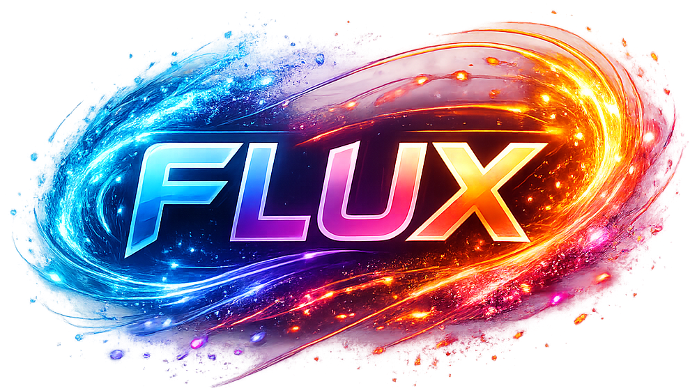

# Flux (PyTorch + pygame)



Flux is a professional starter project for an **interactive 2D particle simulation** with a game-ready architecture.

The simulation is computed with **PyTorch** (GPU when available, CPU fallback) and rendered with **pygame**.

## Features

- Square playground with reflecting boundary conditions.
- Real-time ODE integration (`x'' = F - gamma x'`) with adjustable friction.
- Time-scale slider to accelerate/slow down simulation steps.
- Pairwise self-interaction:
  - attractive long-range force,
  - repulsive short-range force.
- User-controlled external radial Gaussian force centers:
  - drag centers directly in the playground,
  - blue centers are attractive, red centers are repulsive,
  - circle radius visualizes external force bandwidth.
- Particle count slider from **1 to 300**:
  - decreasing removes random particles,
  - increasing creates particles at random positions.
- Clean, modular repository with a reusable toolbox and basic tests.

## Project Layout

```text
.
├── main.py
├── pyproject.toml
├── requirements.txt
├── src/
│   └── dynamics_sim/
│       ├── app.py
│       ├── config.py
│       ├── simulation.py
│       ├── toolbox/
│       │   ├── physics.py
│       │   └── utils.py
│       └── ui/
│           └── slider.py
└── tests/
    └── test_physics.py
```

## Installation

```bash
python -m venv .venv
source .venv/bin/activate
pip install -e .
```

Or with requirements only:

```bash
pip install -r requirements.txt
```

## Run

```bash
python main.py
```

or

```bash
flux
```

## Controls

- Use sliders on the right panel to tune friction, interaction strengths/ranges, external force parameters, time scale, and particle count.
- Click and drag the blue/red force centers inside the playground.

## Notes

- The app uses CUDA automatically when `torch.cuda.is_available()` is `True`.
- At 300 particles, the pairwise interaction is still responsive due to vectorized PyTorch operations.

## Tests

```bash
pytest
```

## Roadmap Ideas

- Goal/reward mechanics and score system.
- Presets/scenarios and restart button.
- Better integrators (RK2/RK4) and optional energy diagnostics.
- Sound and visual FX for game feel.
